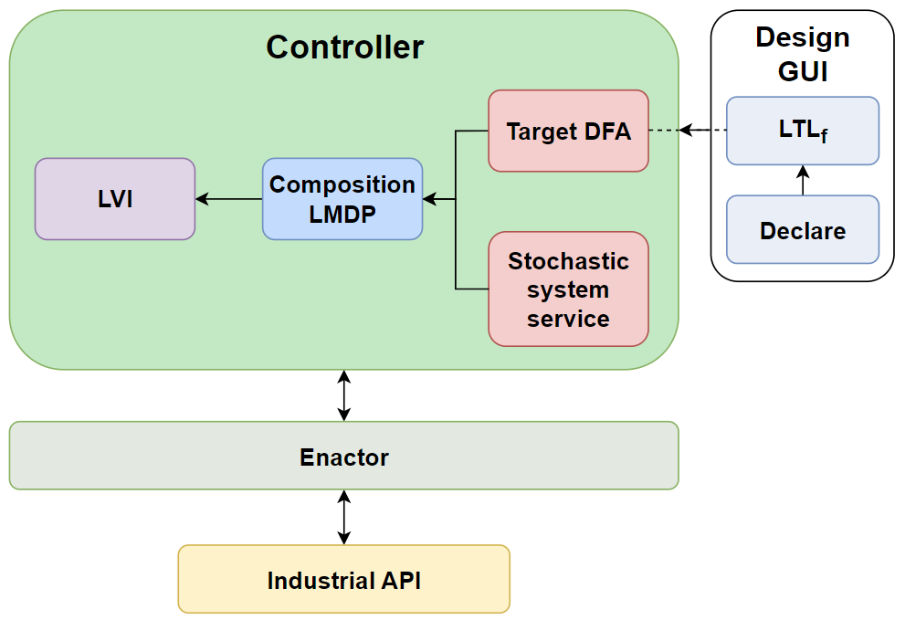
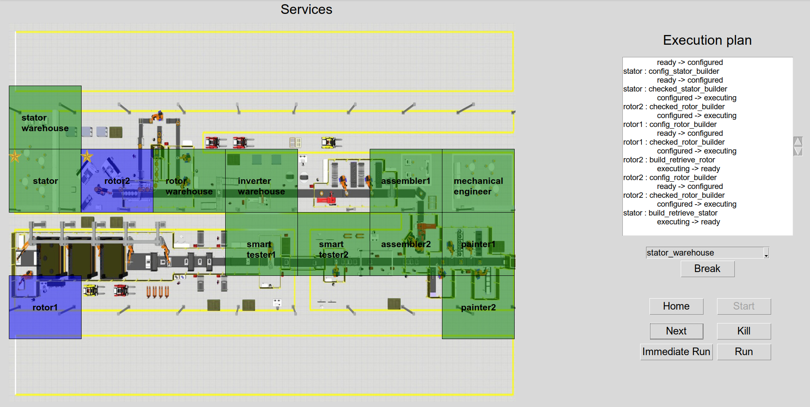

<div align="center">    

# AIDA


[](https://link.springer.com/chapter/10.1007/978-3-031-34674-3_14)
[](https://www.diag.uniroma1.it/gruppi-di-ricerca/25462)
[](./LICENSE)

</div>

AIDA (Adaptive InDustrial APIs) is a tool for the composition of Industrial APIs for resilience manufacturing. 

The proposed technique generates a plan for a manufacturing process by orchestrating manufacturing actors which are depicted as services.


## Abstract
> One of the salient features of Industry 4.0 is that machines and other actors involved in the manufacturing process provide Industrial APIs that allow to inquire their status. In order to provide resilience, the manufacturing process should be able to automatically adapt to new conditions, considering new actors for the fulfillment of the manufacturing goals. As a single manufacturing process may include several of these actors, and their interfaces are often complex, this task cannot be easily accomplished in a completely manual way. In this work, we focus on the orchestration of Industrial APIs using Markov Decision Processes (MDPs). We present a tool implementing stochastic composition of processes and we demonstrate it in an Industry 4.0 scenario.

## Architecture
<div align="center">    

</div>

- **Design GUI**: graphic tool to model manufacturing actors and goal
- **Controller**: computing the optimal policy of the stochastic composition problem
- **Enactor**: acting as a middleware between controller and Industrial API
- **Industrial API** platform: realizing the services representing the manufacturing actors


## Preliminaries

We assume the user uses a **UNIX-like** machine and that has **Python 3.10** installed.

- To set up the virtual environment install [Pipenv](https://pipenv-fork.readthedocs.io/en/latest/) (<code>pip install pipenv</code>), then execute
```bash
pipenv install --dev
```

- Start a shell within the Python virtual environment (to be done whenever a new terminal is opened):
```bash
pipenv shell
```

- Install the Python package in development mode:
```bash
pip install -e .
```

- Install Graphviz to use rendering functionalities. 
  At [this page](https://www.graphviz.org/download/) you will find the releases for all the supported platform.

- Install [Lydia](https://github.com/whitemech/lydia). 
  We suggest to install it by [building it from source](https://github.com/whitemech/lydia#build-from-source).

- Install [xterm](https://invisible-island.net/xterm/).
```bash
sudo apt install xterm
```

- Install Python GUI Tkinter module:
```bash
sudo apt install python3-tk
```

- Generate Python client from OpenAPI v3.0 specification (maybe you need to change permissions of the script file):
```bash
cd local/IndustrialAPI/actors_api_lmdp_ltlf/openapi_client_script
# chmod 777 generate-openapi-client.sh
./generate-openapi-client.sh
```

## Structure of the code
- `aida`: the library that contains reusable software components of the code where services, target and the composition LMDP are defined.
- `local`: the library that shows the orchestration of the Industrial APIs.
- `GUI`: the GUI of AIDA tool.
- `docs/notebooks/electric-motor-production.ipynb`: the notebook that shows the electric motor case study using Lexicographic Markov Decision Processes.

## Run the tool
```bash
cd GUI
python Adaptive.py
```

### Design time
A design time frame allows to model both services (.sdl) and manufacturing goal (.tdl). Such models are usually saved in specific folders inside [saved_models](GUI/saved_models/).

### Run time
<div align="center">    

</div>

A run time frame allows to generate and execute the optimal policy (plan). The set-up of this phase depends on the selection of a proper configuration file. [config_files](GUI/config_files/) contains some configuration files.


## Instructions on how to run the experiment
- To run the local code each of the following commands must be executed on a separate terminal with the virtual environment activated.

First, run the HTTP server that acts as a service repository and a communication middleware:
```bash
cd local/IndustrialAPI
python app.py
```

Then, put the <code>.sdl</code> and <code>.tdl</code> files representing services and target respectively in the relative directory, i.e,. [descriptions](local/IndustrialAPI/actors_api_mdp_ltlf/descriptions/). 

Run all the services (i.e. Industrial APIs):
```bash
cd local
python launch_devices.py
```
Finally, run the orchestrator:
```bash
cd local
python main.py
```

- To see the Jupyter Notebook run the server:
```bash
jupyter-notebook
```
then, open the link and navigate through `docs/notebooks` and run the notebook [electric-motor-production.ipynb](./docs/notebooks/electric-motor-production.ipynb) to replicate the experiment.


## Cite this work
```bibtex
@inproceedings{degiacomo2023aida,
  title={{AIDA: A Tool for Resiliency in Smart Manufacturing}},
  author={De Giacomo, Giacomo and 
    Favorito, Marco and 
    Leotta, Francesco and 
    Mecella, Massimo and 
    Monti, Flavia and 
    Silo, Luciana},
  booktitle={Intelligent Information Systems. CAiSE 2023},
  pages={112--120},
  year={2023},
  publisher={Springer},
  doi={10.1007/978-3-031-34674-3_14}
}
```


## License
The software is released under the MIT license.
